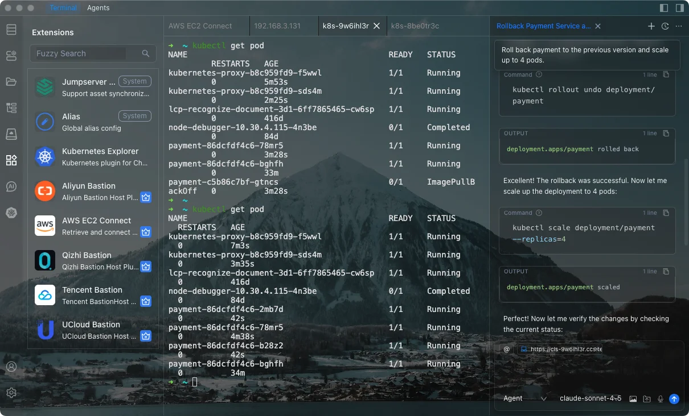

<div align="center">
  <a href="./README_zh.md">中文</a> / <a href="./README.md">English</a> / 日本語
</div>
<br>

> **これはイントラネット版** です。[chaterm/Chaterm](https://github.com/chaterm/Chaterm) からフォークし、
> クラウドサービスに依存せずイントラネット環境での展開用に修正されています。
>
> - ログイン不要 - 直接メイン画面を開始
> - クラウド同期なし - すべてのデータはローカルに保存
> - 日付ベースのバージョン管理 (yyyy.MM.dd)
>
> クラウド機能を含むオリジナル版は [chaterm/Chaterm](https://github.com/chaterm/Chaterm) をご覧ください。

<br>

<p align="center">
  <a href="https://www.producthunt.com/products/chaterm?embed=true&utm_source=badge-featured&utm_medium=badge&utm_campaign=badge-chaterm" target="_blank" rel="noopener noreferrer"></a>
</p>

<p align="center">
  <a href="https://www.tbench.ai/leaderboard/terminal-bench/1.0"></a>
  <a href="https://aws.amazon.com/cn/blogs/china/chaterm-aws-kms-envelope-encryption-for-zero-trust-security-en/"></a>
  <a href="https://landscape.cncf.io/?item=provisioning--automation-configuration--chaterm"></a>
  <p align="center">
</p>

<p align="center">
  <a href="https://github.com/chaterm/Chaterm/releases"></a>
  
  
  
  
  <a href="https://x.com/chaterm_ai"></a>
  <a href="https://discord.gg/AgsYzwRp62"></a>
</p>

<p align="center">
  <a href="https://chaterm.ai/download/"></a>
  <a href="https://chaterm.ai/download/"></a>
  <a href="https://chaterm.ai/download/"></a>
  <a href="https://apps.apple.com/us/app/chaterm/id6754307456"></a>
  <a href="https://play.google.com/store/apps/details?id=com.intsig.chaterm.global"></a>
  <a href="https://aws.amazon.com/marketplace/"></a>
  <p align="center">
</p>

## 目次

- [製品紹介](#製品紹介)
- [Chatermを選ぶ理由](#chatermを選ぶ理由)
- [主な機能](#主な機能)
- [開発ガイド](#開発ガイド)
  - [Electronのインストール](#electronのインストール)
  - [インストール](#インストール)
  - [開発](#開発)
  - [ビルド](#ビルド)
- [Chaterm 参考文献](https://chaterm.ai/docs/)
  - [Achieving Secure and Intelligent Operations for AWS Private Subnets Using Chaterm](https://aws.amazon.com/cn/blogs/china/bastion-using-aws-eice-ec2-instance-connect-endpoint-chaterm-implement-subnet-security-intelligent-en/)
  - [How Chaterm’s Security Architecture Ensures Data Security and Reliability](https://aws.amazon.com/cn/blogs/china/chaterm-aws-kms-envelope-encryption-for-zero-trust-security-en/)
  - [Enhancing DevOps Intelligence with Chaterm Skills and Qwen Models](https://chaterm.ai/blog/posts/agent-skills)
- [Gold Sponsors](#gold-sponsors)
- [Contributors](#contributors)

# 製品紹介

Chatermは、インフラストラクチャおよびクラウドのリソース管理向けに構築されたAIネイティブターミナルです。エンジニアは自然言語を使用して、サービスのデプロイ、トラブルシューティング、問題解決といった複雑なタスクを実行できます。

Chatermは、組み込みのエキスパートレベルの知識ベースと強力なプロキシ推論機能により、お客様のビジネストポロジーと運用目標を理解します。複雑なコマンド、構文、パラメータを記憶する必要はありません。タスクの目的を自然言語で記述するだけで、Chatermはコード構築、サービスデプロイ、障害診断、自動ロールバックといった主要プロセスを含む、複数のホストまたはクラスタにわたる複雑な操作を自律的に計画および実行できます。

長期記憶とチームの知識ベースを活用することで、Chatermはチームの知識とユーザーの習慣を学習します。Chatermの目標は、再利用可能なエージェントスキルを通じてエンジニアが日々のタスクをより効率的に完了できるよう支援する、インテリジェントなDevOpsコパイロットとなることです。Chatermは、さまざまなテクノロジースタックに関連する認知障壁を低減し、すべての開発者がシニアSREの運用経験と実行能力を迅速に習得できるようにすることを目指しています。




## Chatermを選ぶ理由

Chatermは単なるスマートなターミナルではなく、インフラストラクチャエージェントです。
すべてのエージェントは常に失敗するという言葉がありますが、Chatermはそれを修正する手助けをします。

- 🤖 コマンドから実行へ - タスクを記述し、AIに計画と実行を任せる

- 🌐 実際のインフラストラクチャ向けに構築 - サーバー、Kubernetes、マルチクラスターワークフロー

- 🔁 再利用可能なエージェントスキル - 経験を自動化に変換

- 🧠 コンテキスト認識インテリジェンス - コマンドだけでなく、システムを理解

- 🛡️ 安全で制御可能 - 監査可能、レビュー可能、ロールバック対応

## 主な機能

- 🤖 **AIインテリジェントエージェント**

  エージェントはターゲットを理解し、自律的に計画を立て、複数のホストにまたがる問題分析と根本原因の特定を行い、ループを自動的に閉じて複雑なプロセス処理を完了します。

  すべての操作は監査および追跡可能であり、迅速なログロールバックをサポートしているため、本番環境におけるAIオートメーションの安全性と信頼性が向上します。

- 🧠 **インテリジェントコマンド推奨**

  エージェントは、ユーザーの習慣、ローカルメモリ、現在のサーバーコンテキストを組み合わせて、最適なコマンドを推奨し、端末入力をよりスマートかつ効率的にします。

  デバイス間のセッション同期をサポートし、クイックコマンドと音声対話によりモバイル入力コストを削減し、リモートメンテナンスをよりスムーズにします。

- 🧩 **ユーザーナレッジベース**

  技術マニュアル、社内文書、スクリプト、ホワイトペーパーをインポートして、個人のメンテナンスナレッジシステムを構築できます。

  Chatermは現在のインフラストラクチャコンテキストを理解し、関連するナレッジを正確に取得することで、タスクの意思決定と実行を支援します。

- ⚡ **エージェントスキル**

  複雑なメンテナンスプロセスを再利用可能なAIスキルにカプセル化し、構造化された信頼性の高い自動実行を実現します。

  チームの運用経験を蓄積し、AIを実際の本番環境に安全かつ安定的に適用できるようにします。

- 🔌 **プラグインシステム**

  プラグイン拡張機能を通じて、パブリッククラウドサーバーとKubernetesの統合認証、動的認可、安全な暗号化接続を実現します。

  より効率的なリソースアクセスエクスペリエンスを提供し、インフラストラクチャの集中管理を促進します。


## イントラネット版说明

本项目 Fork 自 [chaterm/Chaterm](https://github.com/chaterm/Chaterm)，专为**イントラネット部署**而设计,无需云服务依赖.

### 为什么需要这个 Fork?

原版 Chaterm 依赖以下云服务:
- 用户认证 (登录/注册)
- 跨设备数据同步
- 订阅和计费管理
- 云端 AI 模型访问

对于需要在隔离内网环境中部署的组织, 这些云依赖并不适用。本 Fork 移除了所有云相关功能, 提供**完全离线**的使用体验.

### 主要修改对比

| 类别 | 原版 | 内网版本 |
|------|------|----------|
| 登录系统 | 需要手机/邮箱登录 | 自动以访客身份登录,无需认证 |
| 用户菜单 | 头像下拉菜单含登录/登出 | 从侧边栏移除用户菜单 |
| 计费功能 | 设置中的订阅管理标签页 | 从设置中移除 |
| AI 标签 | 无模型时显示登录提示 | 只显示"配置模型"按钮 |
| 数据同步 | 云端跨设备同步 | 所有数据仅存储在本地 |
| CI/CD | 手动发布 | 每次推送自动构建 |
| 版本管理 | 语义化版本 (如 0.9.3) | 日期格式 (yyyy.MM.dd) |

### 访客用户详情
内网版本自动以访客身份登录:
- **UID:** 999999999
- **用户名:** guest
- **邮箱:** guest@chaterm.ai

### 构建产物
| 平台 | 文件名 | 说明 |
|------|--------|------|
| Windows x64 | `chaterm-{date}-cn-setup-x64.exe` | NSIS 安装程序 |
| macOS ARM64 | `chaterm-{date}-cn-macos-arm64.zip` | Apple Silicon |
| macOS x64 | `chaterm-{date}-cn-macos-x64.zip` | Intel Mac |

### 快速开始
1. **下载** 最新版本: [Releases](https://github.com/BobbyNie/Chaterm/releases)
2. **安装** 应用
3. **配置 AI 模型**: 进入设置 → 模型配置, 添加本地 AI 模型或 Ollama 服务
4. **开始使用**: 无需登录, 所有功能立即可用

## 开发指南

### Electronのインストール

```sh
npm i electron -D
```

### インストール

```bash
node scripts/patch-package-lock.js
npm install
```

### 開発

```bash
npm run dev
```

### ビルド

```bash
# Windows向け
npm run build:win

# macOS向け
npm run build:mac

# Linux向け
npm run build:linux
```

## Gold Sponsors

 

## Contributors

Chatermへの貢献ありがとうございます！
詳細については<a href="./CONTRIBUTING.md">貢献ガイド</a>をご参照ください。

<div align=center style="margin-top: 30px;">
  <a href="https://github.com/chaterm/Chaterm/graphs/contributors">
    
  </a>
</div>
